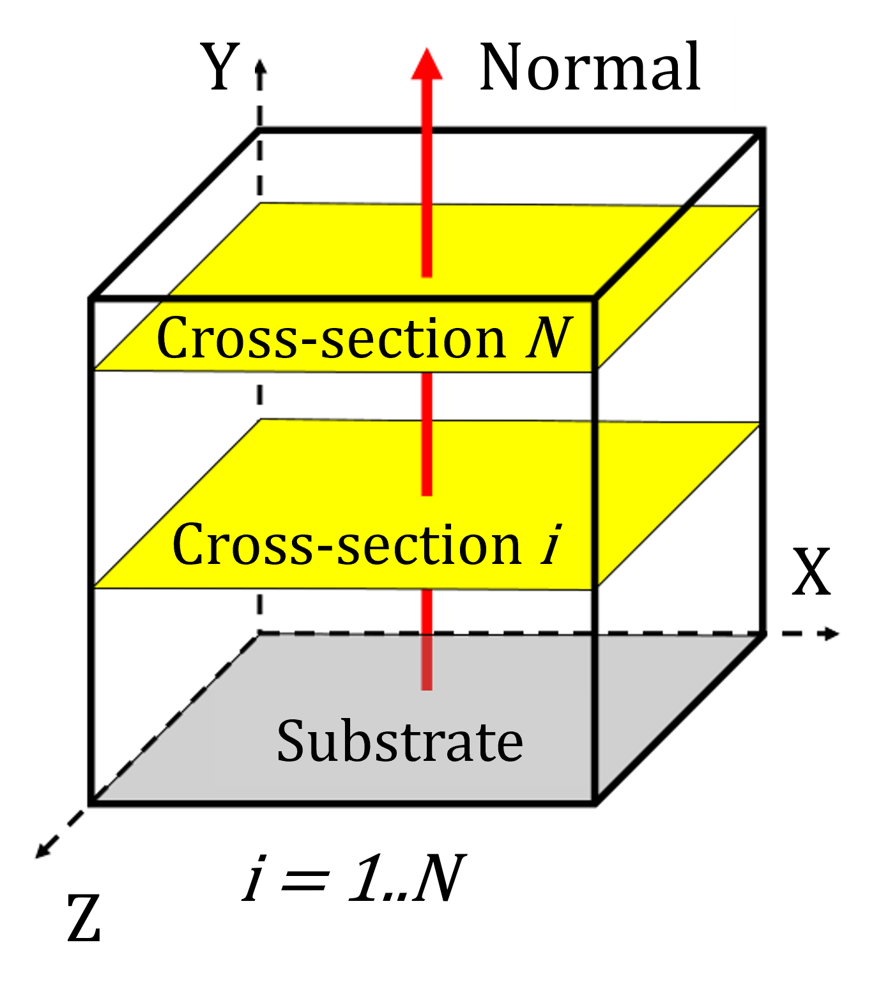
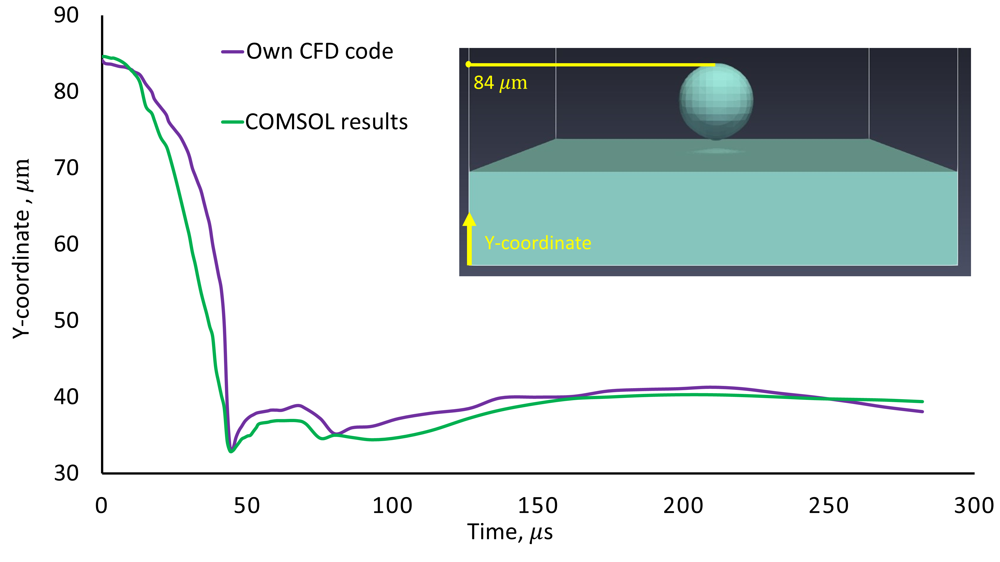
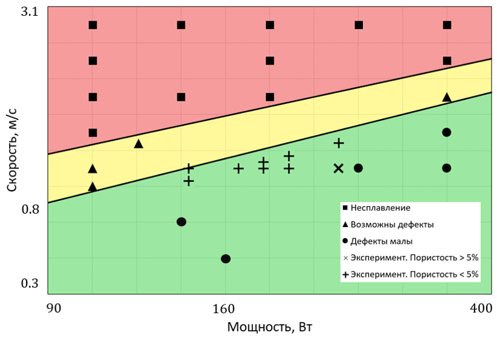

# Модуль анализа данных математического моделирования процессов 3D-печати

> Примечание: исходный код проекта является интеллектуальной собственностью и защищен NDA. Данный репозиторий содержит описание архитектуры, применяемых алгоритмов и результаты верификации.

**Статус:** Проект завершен, результаты опубликованы.  
**Стек:** `C++`, `gnuplot` / `Paraview` (визуализация), `Python`, `XML`, `MPI`, `COMSOL Multiphysics` (CFD), ETL, проектирование процессов (UML), k-means кластеризация, математическое моделирование (Навье-Стокса)

## Краткое описание
Крупный проект, посвященный созданию автоматизированного программного комплекса для моделирования и анализа процессов 3D-печати металлами (SLM и DED).

Моя роль: разработка модуля физической адаптации и аналитики данных. Интегрировал стороннее вычислительное ядро (CFD solver) в единый пайплайн, дополнил его расширенными физическими моделями (температурная зависимость теплофизических свойств) и разработал систему автоматического анализа качества печати.

Бизнес-результат:

* Построена карта технологических режимов, позволяющая сократить расход порошка до 50% за счет минимизации брака.
* Время анализа одной гипотезы сокращено с дней (натурный эксперимент) до часов (моделирование + авто-аналитика).

Научный результат:
 * Опубликована статья по динамике и кинетике консолидации металлических порошоков (ссылка ниже).
 * Определены новые характеристические времена проходящих теплофизических процессов.
 * Найдены физические допущения, позволяющие сэкономить вычислительные ресурсы, не ухудшая точность решения.
### Публикация
Результаты верификации и математические выкладки доступны в статье в журнале **Physics of Fluids (Q1)**:
[Capillary effects and consolidation kinetics during selective laser melting of 316L powder](https://doi.org/10.1063/5.0195071)
> Если нет доступа к журналу - напишите мне лично - вышлю PDF

# Архитектура решения
Система работает как конвейер (pipeline), где модуль управляет конфигурацией расчёта и интерпретирует сырые данные моделирования.
### Data-flow диаграмма
Нормализованный (обезличенный) вид диаграммы модуля и его взаимодействия с другими модулями приведён ниже.

## Реализованная функциональность
1. **Оркестрация**: Запуск вычислительного ядра и последующий анализ через конфигурационный файл (.CFG).
2. **Интеграция (Interoperability)**  Разработка XML-схемы для обмена данными между моим модулем аналитики и внешними модулями коллег.
3. **Парсинг результатов**: чтение выходных файлов солвера, извлечение полей скоростей и фазового состояния.
4. **DLL/EXE**: поддержка запуска модуля как отдельным приложением, так и в качестве динамической библиотеки.
5. **Переключение технологий**: поддержка анализа данных и SLM, и DMD (набор выходных данных меняется в зависимости от технологии).

## Математическое моделирование и R&D
Ядро солвера (стороннее решение) решало изотермическую систему уравнения Навье-Стокса в приближении метода функции уровня.  

$$\rho(\varphi) \left( \frac{\partial \mathbf{u}}{\partial t} + (\mathbf{u} \cdot \nabla) \mathbf{u} \right) = \nabla \left[ -p\mathbf{I} + \mu \left( \nabla \mathbf{u} + (\nabla \mathbf{u})^T \right) \right] + \rho(\varphi) \mathbf{g} + \sigma \delta \kappa \mathbf{n}$$

$$\nabla \cdot \mathbf{u} = 0$$

$$\frac{\partial \varphi}{\partial t} + (\mathbf{u} \cdot \nabla) \varphi = 0.$$
> **Подробнее о математической модели, граничных услових и численной реализации описано в [статье](https://doi.org/10.1063/5.0195071).**

Моя задача заключалась в адаптации физической модели под реальные условия лазерного плавления.

### 1. Модификация физики материалов
Внедрил температурные зависимости для таких характеристик как плотность $\rho(T)$ и динамическая вязкость $\mu(T)$, что критически важно для точности расчета и корректности описания процесса.
Интегрировал в вычислительное ядро линейную интерполяцию температурного поля (на основе внешних источников) и аналитическое решение Розенталя для моделирования теплового источника (лазера).

### 2. Анализ чувствительности
Провел исследование устойчивости модели для оптимизации вычислительных затрат:
* Определил допустимые пределы увеличения вязкости, при которых решение остается физически корректным, но считается в 2-3 раза быстрее.
* Оптимизировал параметры расчетной сетки для баланса между точностью и скоростью.

## Алгоритмы аналитики данных
Главная ценность модуля — автоматическое извлечение необходимых метрик из "сырого" 3D-поля.

### 1. Кластеризация дефектов
Разработал алгоритм (C++), который сканирует 3D-объем системы "газ-металл" во время течения и после застывания (за основу взят k-means).
* Подсчёт областей узлов газовой фазы внутри металла.
* Кластеризация: определение газовых пор (дефектов) и их сферичности.
* Гистограммы: построение распределений дефектов по глубине залегания и размеру.

> Как оказалось, плотностные алгоритмы типа DBSCAN были бы лучше, но k-means-подобный алгоритм уже прошёл верификацию на эксперименте, поэтому было решено оставить.

### 2. Расчет метрик качества
* Профиль пористости: расчет средней пористости в сечениях, имеющих выбранный вектор нормали [nx, ny, nz] (оценка качества слоёв по высоте).

* Кинетика плавления: вычисление характеристических времён процесса, таких как время полного поглощения частицы и времени плавления твердой фазы.

##  Результаты

### 1. Верификация
Для проверки точности интегрированной модели проводилось два типа сравнений: с экспериментальными данными и сравнение с коммерческим пакетом COMSOL Multiphysics.
Экспериментальные данные носят закрытый характер и показаны не будут, сравнение с COMSOL Multiphysics 

Тест: погружение частицы под действием капиллярных сил.
Результат: модель показала высокую сходимость.
Ниже приведён график динамики погружения: C++ модуль vs COMSOL:

### 2. Карта режимов (business & tech outcome)
Итоговый результат работы программы - карта, показывающая инженерам "зеленую зону" настроек принтера.

Пример карты (**данные в примере - искусственные**):

## Прочие работы в рамках данного проекта
Составление программной и научной документации, ниже приведён полный список сопровождаемых и составленых автором документов:
* Отчёт СЧ НИОКР
* Программа и методика испытаний (ПМИ)
* Техническое задание
* Руководство оператора
* Руководство программиста
* Интеграция и сопряжение
* Текст программы
* Верификация и корректировка

Таким образом, выполненный проект задокументирован полностью: программный код, архитектура, алгоритм работы, возможные ошибки и их устранение, результаты и их интерпретация, изменения (которые появились в процессе корректировки технического задания).

## Комментарии
Модель аналитики завершена, но проект продолжает разрабатываться соавторами и коллегами, список которых есть в [статье](https://doi.org/10.1063/5.0195071).
